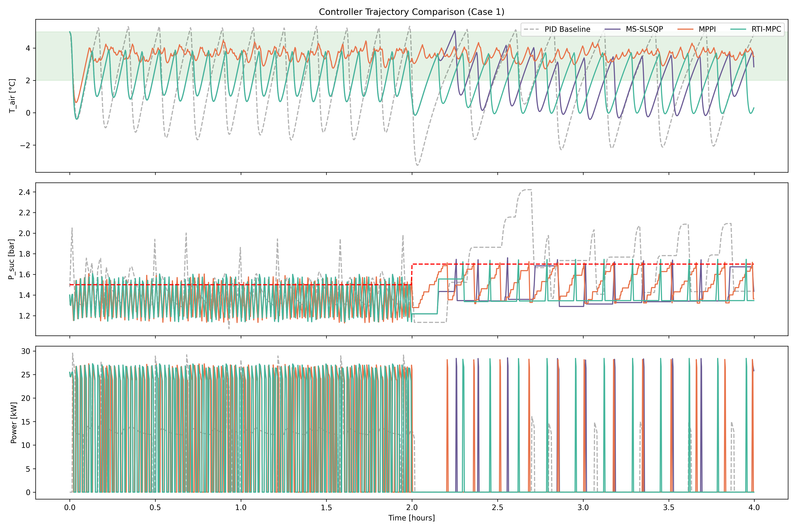

# ECC'07 Supermarket Refrigeration Benchmark

Implementation of the ECC'07 supermarket refrigeration benchmark from Larsen et al. (2007), with PID baseline and MPC controllers.

## Overview

This repository provides:

1. **PID Baseline**: Traditional hysteresis-based control from the benchmark paper
2. **MS-SLSQP**: Multiple Shooting MPC with Sequential Quadratic Programming
3. **MPPI**: Model Predictive Path Integral control (sampling-based)
4. **RTI-MPC**: Real-Time Iteration MPC (linearized QP)

All MPC controllers use a **hysteresis layer** to translate continuous optimization outputs to discrete valve/compressor actuation.

### Scenarios

Two benchmark scenarios from the paper are supported:

| Scenario | Display Cases | Compressors | VFD | Description |
|----------|---------------|-------------|-----|-------------|
| `2d-2c`  | 2             | 2 × 50%     | No  | Discrete compressor control |
| `3d-3c`  | 3             | 40% + 2×30% | Yes | First compressor has Variable Frequency Drive |

## Key Insight: Hysteresis for Hybrid Systems

The refrigeration system is a **hybrid system** with:
- Continuous dynamics (temperatures, pressure)
- Discrete actuators (valves: 0/1, compressor: 0/50/100%)

Pure optimization fails because it outputs smooth controls that get discretized inconsistently. The **hysteresis layer** provides proper bang-bang cycling:

| Variable | Turn ON threshold | Turn OFF threshold | Dead Band |
|----------|-------------------|-------------------|-----------|
| Valves   | T_air > 4.5°C     | T_air < 3.5°C     | 1.0°C     |
| Compressor | P_suc > P_ref   | P_suc < P_ref - 0.3 | 0.3 bar |

## Results

All three MPC methods **outperform the PID baseline** on both constraints:

| Controller | T_air ∈ [2,5]°C | P_suc ≤ P_ref | Status |
|------------|-----------------|---------------|--------|
| MS-SLSQP   | ✓               | ✓             | Works  |
| MPPI       | ✓               | ✓             | Works  |
| RTI-MPC    | ✓               | ✓             | Works  |
| PID        | ✗ (undershoots) | ✗ (violates)  | Baseline |



## Installation

```bash
# Clone repository
git clone https://github.com/pierrelux/larsen-supermarket-benchmark.git
cd larsen-supermarket-benchmark

# Create virtual environment
python -m venv venv
source venv/bin/activate  # On Windows: venv\Scripts\activate

# Install dependencies
pip install -r requirements.txt

# Run comparison
python compare_controllers.py
```

## File Structure

```
├── supermarket.py           # Core dynamics (Python + JAX implementations)
├── mpc_controller.py        # MS-SLSQP controller with hysteresis
├── mppi_controller.py       # MPPI controller with hysteresis
├── rti_mpc.py               # RTI-MPC controller with hysteresis
├── compare_controllers.py   # Run all controllers and generate plots
├── poster_supermarket.html  # Scientific poster (open in browser)
├── controller_comparison.png # Results plot
├── requirements.txt         # Python dependencies
├── README.md               # This file
└── extras/
    └── bo_tuning/           # Optional: Bayesian Optimization for PID tuning
        ├── tune_pid_with_bo.py
        └── BO_TUNING_GUIDE.md
```

## Usage

### Run Controller Comparison

```python
python compare_controllers.py
```

This runs a 4-hour simulation with day/night transition and compares all controllers.

### Use Individual Controllers

```python
from supermarket import RefrigerationSystem
from mpc_controller import optimize_full_trajectory

# Run MS-SLSQP MPC
results = optimize_full_trajectory(duration=14400, window_size=180, dt=10.0)

# Access results
time = results['time_opt']
T_air = results['T_air_opt']
P_suc = results['P_suc_opt']
power = results['power_opt']
```

### Run PID Baseline

```python
from supermarket import run_scenario

# Run 2d-2c scenario (2 display cases, 2 compressors)
time, T_air, P_suc, P_ref, comp_cap, power, valve_states, comp_switches, _, n_cases = \
    run_scenario('2d-2c', duration=14400, dt=1.0)

# Run 3d-3c scenario (3 display cases, 3 compressors with VFD)
time, T_air, P_suc, P_ref, comp_cap, power, valve_states, comp_switches, _, n_cases = \
    run_scenario('3d-3c', duration=14400, dt=1.0)
```

Or use the low-level API:

```python
from supermarket import RefrigerationSystem

# 2d-2c scenario
system = RefrigerationSystem(n_cases=2, comp_capacities=[50.0, 50.0], V_sl=0.08)

# 3d-3c scenario (with VFD)
system = RefrigerationSystem(n_cases=3, comp_capacities=[40.0, 30.0, 30.0], V_sl=0.095, has_vfd=True)

system.set_day_mode()
for step in range(1440):
    t = step * 10.0
    if t >= 7200:
        system.set_night_mode()
    valves, comp_on, power, comp_switches = system.simulate_step(dt=10.0, current_time=t)
```

## Configuration

### Scenario Parameters

| Parameter | Day Mode | Night Mode |
|-----------|----------|------------|
| Q_airload | 3000 W   | 1000 W     |
| m_ref_const | 0.2 kg/s | 0.0 kg/s |
| P_ref     | 1.5 bar  | 1.7 bar    |

### Hysteresis Thresholds (in controllers)

```python
# Temperature hysteresis for valves
if T_air_avg < 3.5:
    valves = 0  # CLOSE
elif T_air_avg > 4.5:
    valves = 1  # OPEN

# Pressure hysteresis for compressor
if P_suc > P_ref:
    comp_mode = 'on'
elif P_suc < P_ref - 0.3:
    comp_mode = 'off'
```

## Dependencies

- Python 3.10+
- JAX (with float64 enabled)
- NumPy
- SciPy
- Matplotlib

## Optional: PID Tuning with Bayesian Optimization

For automatic PID parameter tuning, see `extras/bo_tuning/`:

```bash
pip install ax-platform
python extras/bo_tuning/tune_pid_with_bo.py
```

## Reference

Larsen, L. F. S., Izadi-Zamanabadi, R., & Wisniewski, R. (2007, July 2-5). 
Supermarket Refrigeration System - Benchmark for Hybrid System Control. 
*Proceedings of the European Control Conference 2007*, Kos, Greece. TuA03.5.

## License

MIT License

